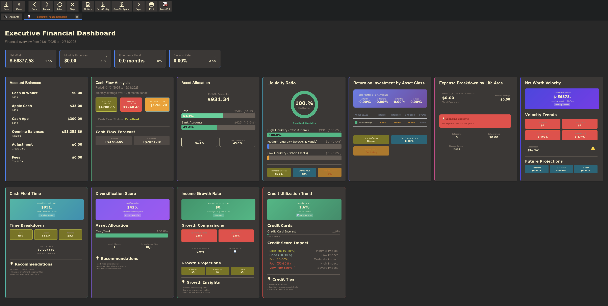

# GnuCash Executive Financial Dashboard



## Project Overview

The GnuCash Executive Financial Dashboard is a comprehensive financial intelligence platform that transforms your GnuCash data into sophisticated analytical insights. Built as a native GnuCash report module using Scheme, this dashboard provides executive level financial analytics with modern visualizations and quantitative finance metrics.

This dashboard bridges the gap between traditional accounting software and modern financial analytics, offering portfolio theory implementations, risk metrics, performance attribution, and advanced trend analysis—all within GnuCash's familiar interface.

## Key Features

### KPI Cards

- **Net Worth**: Real-time net worth tracking with growth metrics and trend indicators
- **Monthly Expenses**: Current month spending with period-over-period comparison
- **Emergency Fund**: Adequacy assessment showing months of expenses covered
- **Savings Rate**: Percentage of income saved with target benchmarking

### Advanced Analytical Widgets

#### Investment & Asset Analysis

- **Asset Allocation**: Visual breakdown of investments by asset class with diversification insights
- **ROI by Asset Class**: Investment performance tracking with time-weighted returns
- **Diversification Score**: Portfolio concentration risk analysis using quantitative metrics
- **Liquidity Ratio**: Liquid vs illiquid asset analysis for cash flow planning

#### Expense Intelligence

- **Expense Ratio by Life Area**: Sophisticated spending categorization and analysis
- **Expense Trend Chart**: Period-over-period spending analysis with seasonal adjustments
- **Cash Float Time**: Liquidity runway analysis showing time until cash depletion

#### Growth & Performance Metrics

- **Net Worth Velocity**: Rate of wealth change tracking with acceleration metrics
- **Income Growth**: Revenue trend analysis with year-over-year comparisons
- **Credit Utilization**: Credit card usage optimization with risk assessment

## Installation

### Basic Installation

1. Save the dashboard file to your GnuCash reports directory:

   ```
   ~/Library/Application Support/GnuCash/executive-dashboard.scm
   ```

   (On Linux: `~/.local/share/gnucash/executive-dashboard.scm`)

2. Create a simple loader file at:

   ```
   ~/Library/Application Support/GnuCash/config-user.scm
   ```

   With the content:

   ```scheme
   (load (string-append (gnc-build-userdata-path) "/executive-dashboard.scm"))
   ```

3. Restart GnuCash to load the new report module

4. Access the dashboard via: **Reports → Experimental → Executive Dashboard**

## Setup Requirements

### Account Organization

For optimal functionality, organize your accounts following these conventions:

#### Investment Accounts

- Place investment accounts under `Assets:Investments`
- Use descriptive names for automatic categorization
- Example structure:

  ```
  Assets:Investments:
    ├── 401k
    ├── IRA
    ├── Brokerage
    └── Real Estate
  ```

#### General Account Structure

- Use clear, descriptive account names
- Group related accounts under logical parents
- Maintain consistent naming conventions

### Feature-Specific Setup

#### Emergency Fund Configuration

- Create an account containing "Emergency" in the name (case-insensitive)
- Examples:
  - `Assets:Cash:Emergency Fund`
  - `Assets:Emergency Savings`
  - `Assets:Cash:Emergency`
- The widget automatically calculates months of expenses covered

#### Credit Utilization Setup

1. Place credit card accounts under `Liabilities:Credit Card`
2. Add credit limits to account notes in this format:

   ```
   limit: $5000
   ```

3. The system supports multiple cards with individual tracking
4. Portfolio-level utilization and risk assessment is automatically calculated

#### Income and Expense Categorization

- Use detailed expense account names for better categorization
- Group expenses by life areas (Housing, Transportation, Entertainment, etc.)
- Income accounts should be clearly categorized by source

## GTK Theme Integration

The dashboard features theme integration that adapts to your system's appearance:

### Setup

1. Enable "Use GTK theme colors" in the report settings
2. The dashboard automatically reads colors from `gtk-3.0.css` in your GnuCash config directory
3. Supports popular themes including gruvbox-dark

### Theme Support

- **Automatic Detection**: Reads `@define-color` variables from GTK stylesheets
- **Graceful Fallback**: Defaults to professional light theme if no custom theme is found
- **Color Mapping**: Intelligently maps theme colors to dashboard elements:
  - Background colors for cards and widgets
  - Text colors for optimal readability
  - Accent colors for highlights and trends
  - Border colors for visual separation

### Supported Themes

- gruvbox-dark
- Any GTK theme using standard color variables
- Custom themes with `@define-color` definitions

## Advanced Features

### Quantitative Finance Implementation

- **Portfolio Theory**: Modern portfolio theory calculations for asset allocation
- **Risk Metrics**: Value at Risk (VaR), beta calculations, and volatility analysis
- **Performance Attribution**: Factor-based performance analysis
- **Sharpe Ratios**: Risk-adjusted return calculations
- **Maximum Drawdown**: Peak-to-trough loss analysis

### Performance Optimizations

- Efficient data processing for large account sets
- Caching of repeated calculations
- Optimized database queries
- Responsive design that adapts to screen size

### Customization Options

- Individual widget enable/disable controls
- Comparison overlay toggles for trend analysis
- Flexible date range selection
- Multiple visualization formats
- Configurable KPI targets and thresholds

## Technical Architecture

### Built With

- **GnuCash Scheme API**: Native integration with GnuCash's data structures
- **Functional Programming**: Leveraging Scheme's functional paradigms
- **HTML/CSS**: Modern web-based rendering with responsive design
- **Quantitative Libraries**: Custom implementations of financial mathematics

### Code Organization

- **Modular Design**: Each widget is independently implemented
- **Error Handling**: Robust error handling for missing data and edge cases
- **Documentation**: Comprehensive inline documentation
- **Performance**: Optimized for real-time dashboard updates

## Usage Tips

### Getting the Most from Your Dashboard

1. **Regular Updates**: Run the report regularly to track financial trends
2. **Goal Setting**: Use KPI targets to set and monitor financial goals
3. **Trend Analysis**: Enable comparison overlays to spot patterns
4. **Custom Periods**: Adjust date ranges for specific analysis needs

### Troubleshooting

- **Missing Data**: Ensure accounts are properly categorized and contain transactions
- **Performance**: For very large datasets, consider focusing on specific date ranges
- **Theme Issues**: Verify GTK theme files are properly installed and accessible

## Contributing

This project implements sophisticated financial analytics within GnuCash's Scheme environment. When contributing:

- Follow functional programming paradigms
- Maintain compatibility with GnuCash's API
- Include comprehensive error handling
- Document financial calculations and methodologies
- Test with various account structures and data sizes

## License

This project extends GnuCash's functionality and follows its open-source philosophy. Please refer to GnuCash's licensing terms for usage and distribution guidelines.

---

**Note**: This dashboard requires GnuCash 4.0 or later for full functionality. Some advanced features may require specific account organization as detailed in the setup instructions above.
